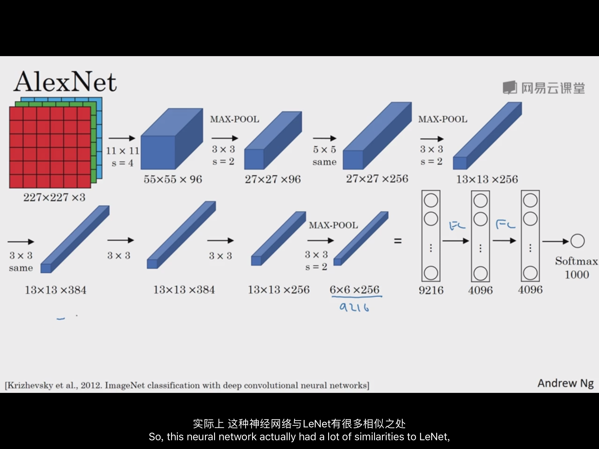
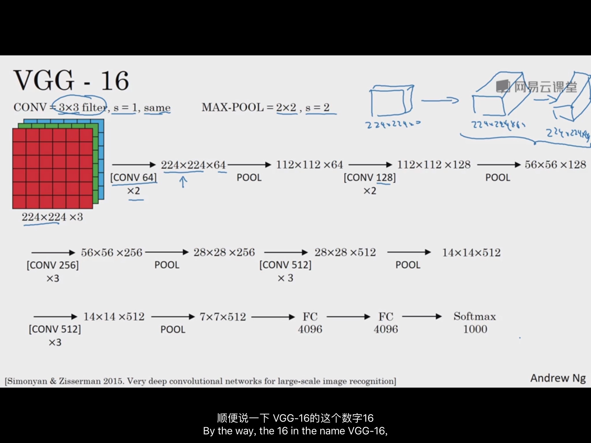
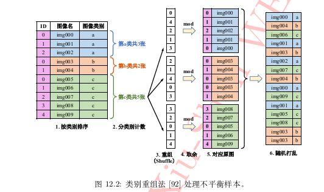

> 好吧，看来一人更新来看，还是超级慢的。。。但是，基本概念不能少啊。撸起柚子干起来啊。  
> 2018-03-06 简化版本 updating...

参考文献：  
[1] 魏秀参."**解析卷积神经网络 --深度学习实践手册**"[[pdf]][pdf-01]

前面：  
深度学习知识表示学习（representation learning）的一种方式。
#### 0.基本概念
知识点：`卷积(convolution)操作`、`汇合(pooling)操作`、`非线性激活函数(non-linear activation function)映射`、
`前馈运算(feed-backward)`、`反向传播算法(back-propagation algorithm)`、`向前反馈(back-forward)`、`交叉损失(cross entropy)函数`、
`最小化损失函数`、`随机梯度下降法(Stochastic Gradient Descent)`、`误差反向传播(error back propogation)`、
`批处理的随机梯度下降法(mini-batch SGD)`
* 卷积神经网络  
卷积神经网络（Convolutional Neural Network，简称CNN）是一类特殊的人工神经网络，其最主要的特点是卷积运算操作。
因此，CNN在诸多领域应用特别是图像相关任务上表现优异，诸如，图像分类（image classification）、图像语义分割
（image semantic segmentation）、图像检索（image retrieval）、物体检测（object detection）等计算机视觉问题。
此外，随着CNN研究的深入，如自然语言处理（Natural Language Processing）中的文本分类，软件工程数据挖掘（software mining）
中的软件缺陷预测等问题都在尝试利用卷积神经网络解决，并取得了相比传统方法甚至其他深度网络模型更优的预测效果。

> batch_size 设置过小，由于样本的误差更新模型，其得出的结果不一定是全局最优，使得训练过程中产生震荡。所以在训练过程中，
尽量加大batch_size。至于batch_size 大小，主要受限于你的电脑资源的配置（主要为GPU）。

* 卷积层 conv  
卷积运算其实是一种数学上的运算，多出现在数字信号处理相关，卷积预算当然不局限是图像这种二维离散卷积，也可以是一维、多维；
离散、连续的。卷积操作可以看做是一小部分核与原信号的乘积和的运算操作。  
在图像作为输入数据为例，这里涉及到几个概念(`卷积核kernel`、`卷积步长stride`、`填充 padding`)。  
对于卷积层使用还有一个内容：`权值共享`(参数的减少)
对于卷积操作的作用，我们可以理解为用来“提取特征”。[TODO] 最好插图说明...
* 汇合层 pooling  
主要使用的是 average-pooling和max-pooling，当然这里面涉及到`kernel`、`stride`。
关于为什么使用汇合层，其主要的作用在于：`特征不变换`、`特征降维`以及在一定程度上防止`过拟合(overfitting)`  
* 激活函数 activation   
激活函数层其也称非线性映射层。其含义是为了将通过非线性函数的映射方式能够将中间含义表述到其他空间上，若不引入非线性映射，则
整个只是对系数乘积，单纯为一种线性映射。激活函数最具有代表的函数有`S(Sigmoid)型函数`、`Relu函数`。
* 全连接层 fully connected layer   
全连接层是神经网络最后的一个连接，其主要是做到“分类”，即对学习到的特征表示映射到样本的标记空间里。当然，在全连接层其操作也可以
通过 `1 * 1` 的卷积完成 
* 目标函数 
在分类问题上，主要使用的是交叉熵损失函数；回归问题主要是L2损失函数。当然，也有其他各种各类的目标函数。

#### 1. 致敬 经典的卷积神经网络
* 理解 CNN"感受视野"   
对于图像的CNN操作，其本身就是对一个“视野”下的感知。也即表示为卷积得到的单个数值为一个区域（卷积核大小）下的视野，当然对于多层卷积，
其描述的更为是更宽的视野。此外，在选择卷积核同时，叠加的小卷积核也是不错的一个选择。
因为小卷积核可以通过多层叠加获得与大卷积核同等规模的感受野。同时，使用叠加的小卷积核能够加深网络深度从而
增强网络容量和复杂度以及减少参数
* 深度特征的层次性  
卷积操作用来获取图像区域不同类型特征，汇合操作对特征进行融合和抽象，随着若干次卷积、汇合操作，其特征也从最开始的
泛化特征（如边缘、纹理等）过度到高层语义表示（躯干、头部等模式）。对于可视化深度特征的层次性，就本身深度学习的研究，其代表
很重要的意义。深度学习不应是“炼金术”而当为“电力”

(梳理)
##### 1.1 LeNet-5
##### 1.2 Alex-Net 

##### 1.3 GooLeNet
##### 1.4 VGG-Nets  

##### 1.5 Network-In-Network 
##### 1.6 ResNet

#### 2. 参数压缩  
虽然很多领域神经网络都取得出类拔萃的效果，然而其本身的参数数量太多（500MB）且参数运算的次数也较多（309亿浮点操作）才能完成一次
识别。这么参数存储以及参数运算势必不能满足实时性产品应用的，因此有必要对神经网络参数进行一定程度下的压缩。即
用5%甚至更少的参数达到能够适配的效果。  
对于模型压缩技术，其分为 “前端压缩”（不改变原网络结构，主要包括`知识蒸馏`、`紧凑的模型结构设计`、`滤波器的剪枝`等）和“后端压缩”
（尽可能减少模型大小，包括`低秩近似`、`未加限制的剪枝`、`参数量化`以及`二值网络`等） 当然，也是对这两种压缩方式进行
结合。

#### 3.数据扩充  
> 实际上，我们在实际过程中我们的数据集并不能够“足够”，这时应当通过其他方式对数据进行扩充。如图像可以通过水平翻转（horizontally flipping）
和随机抽取（random crops），尺度变换（scaling）、旋转（rotating）、色彩抖动（color jittering）等。对于其他数据扩充，包括：
`Fancy PCA`（分析主成分，在通过特征向量和特征值进行添加随机值）、
`监督式数据扩充`（训练分类的初始模型，生成特征图和热力图，通过特征图或者热力图区域高的地方进行高概率下扣取）

#### 4.数据预处理
> 对于数据预处理是必不可少的。`归一化`(对RGB像素点除于255)、`中心式归一化`（去均值归一化，即对整个图像减去其均值）  
#### 5.参数初始化
> 神经网络模型一般依靠随机梯度下进行模型训练参数和参数更新，但是参数应该选择从哪个初始值进行训练呢？
* 全零初始化  
当网络收敛稳定时候，参数（权值）在理性情况下是处于正负均匀分布的。这样，对参数合理的方式对参数全部设置 0 进行训练。
然而，这种初始化方式，对于梯度下降将是导致同一样的结果，会让所有的结果按照同等的梯度进行更新。这样的训练结果，势必不能
对整个网络参数进行适配的调整，从而不能够进行模型训练
* 随机初始化  
基于全零初始化的不足，我们是否可以通过给最开始的参数很小的“随机值”？遵循这种原则，我们可以
随机生成满足分布（如，正态分布、均匀分布、高斯分布）下的初始值。  
* 其他初始化方法  
这里不得不提到的一个参数初始化方法为，通过得到`预训练模型（pre-trained model）`的参数作为初始化。即通过对在大数据集训练好的参数
作为参数初始化。当然，对应 一般简单方式就是剪枝最后一层，添加为自己的`分类层`。
#### 6.激活函数
> 目前常见的几种激活函数：`S(Sigmoid)型函数`、`tanh型函数`、`修正线性单元（ReLU）`、`Leaky ReLU`、`参数化ReLU`、`随机化ReLU`、`指数化线性单元（ELU）`。

激活函数对深度网络模型引入非线性而产生强大表示能力功不可没；  
S型函数和tanh函数 会产生梯度饱和效应，因此在实践不建议使用。（当然这里是局限说，在其他方面这两个函数是其他作用的）  
建议使用ReLU，当然可以通过改进ReLU进行进一步提高。 

#### 7. 目标函数
[添加函数.....]
* 分类下的目标函数
1. 交叉熵损失函数  
2. 合页损失函数  
3. 坡道损失函数  
4. 大间隔交叉熵损失函数  
5. 中间损失函数  
* 回归类的目标函数
1. L1损失函数  
2. L2损失函数
3. Tukey's biweight 损失函数  
4. 其他   
#### 8.网络正则化 
> 在整个网络的训练过程，我们的目的是使得参数具有`普适性`或者说`泛化能力（generalization ability）`，如果不对模型进行一定的正则化，模型
在整个训练过程中很容易`过拟合`。通常正则化的方法有：` L2 正则化`、` L1 正则化`、`最大范数约束`、`随机失活`。

#### 9.超参数设定和网格训练
* 网格参数化设定  
这里我们还有一个问题需要解决，那就是我们输入的像素应该设置多大，卷积层应该设置为多少层、卷积核设置多大，怎么一个网络搭建？  
1. 输入数据像素大小  
>一般建议，统一压缩到2的n方的大小。当然对于不同net模型，会有其统一的标准，如 224 * 224 以及 299 * 299 。  
2. 卷积层参数设定
> 实践推荐使用 3 * 3 及 5 * 5 的小卷积核的叠加，当然适时搭配 padding 操作使得图像的尺寸不那么快减少。  
3. 汇合参数设定  
> 一般也设置较小的值，如 2 * 2 、3 * 3等  
* 训练技巧  
1. 随机打乱  
> 将数据集打乱训练能够使得训练过程得到一个普适的结果。   
 
2.学习率的设定
> 遵循：1. 初始学习率不宜设定太大； 2. 随着训练次数增加，学习率应当减小  

3. 批规范化操作  
> batch normalization，在模型每次随机梯度下降训练时，通过 mini-batch 来对相应的网络响应（activation）做规范化操作，
使得结果的均值为 0，方差为 1。  

4.优化算法选择。
> 可以参考[这里](http://blog.csdn.net/heyongluoyao8/article/details/52478715)，对每个优化算法进行了解  

5.微调网络--即迁移学习  
> 通过训练好的参数进行迁移训练，这时其学习率应当设置的更小，如 10-4 甚至以下。

#### 10. 不平衡样本的处理 
> 在机器学习的经典假设中，往往假定训练样本的各类样本是同等数量，即保持样本数目是均衡的。但有很多情况下，我们获取到的
数据样本是不均衡的。比如 99 个正例 和 1 个负例。其实，对除了常见的分类、回归任务外，类似`图像语义分割（semantic segmentation）`、
`深度估计（depth estimation）`等像素级别任务也不乏出现不衡量的现象。对于这种现象，我们可以通过从`数据层面`和`算法层面`
给出一定的方法。  

* 数据层  
1. 数据重采样  
> 包括 `上采样（up-sampling）`和 `下采样（down-sampling）`。对于样本较少类，可以通过上采样，即
对较少类别的数据进行复制或者扩充方法得到和较多一致的数量。对于样本较多类别，一般建议下采样，即
对较多类别数据进行随机丢弃一些使得和较少数据一致

2.类别平衡采样 
> `类别平衡采样`其策略是把样本按类别分组，每个类别生成一个样本列表。训练过程中先随机选择 1 个或几个
类别，然后从各个类别所对应的样本列表中随机选择样本。这样可以保证每个类别参与训练的机会比较均衡。  
`类别重组法`，该方法可以描述为：按类别排序好，按最大的样本类别列表生成随机列表，对该列表数字进行求余（除数为
类别的数量）得到每个类别的索引，根据每个类别索引取每个类别的图片，最后将其打乱输入。  

* 算法层面（待仔细琢磨...）
1. 代价敏感方法
> 代价敏感方法分为：代价敏感矩阵、代价敏感向量。其主要想法是在于，对样本数目较小分类错误的代价加权放大。当然描述中，
通过一个 K * K 矩阵（ K 代表样本类别）描述，其用来描述第 i 类被分成 j 类的错分惩罚系数。对应的向量方法则是更为通用的一种
形式。  

2. 代价敏感法中权值制定方式 
> 通过样本比例来制定具体的惩罚系数；通过混淆矩阵指定；

#### 11.模型集成方法  
> 这里指的是，对个多学习器得到的方法进行组合使用的一种方式。 
* 数据层面 
1. 测试阶段数据扩充  
> 通过对测试单个数据集尽进行扩充方式得到多个数据集，并通过训练模型对扩充数据集进行预测，
将预测的置信度进行平均得到最终的预测结果。  

2.“简易集成”法
> 该方法针对不平衡样本提出来的一种集成学习解决方案。即对样本数量多的类别进行降采样，训练获得一个模型进行
预测，然后又再次对样本数量多降采样去训练模型，对测试集进行预测；对多个预测得到的结果进行
平均。  

* 模型层面
1.单模型集成  
> `多层特征融合`：这里提出的是将不同网络特征级联，因为深度卷积神经网络特征具有层次性，不同层特征富含的语义信息
可以相互补充，在图像语义分割、细粒度图像检索、基于视频的表象性格分析等任务常见这种方法的使用。
对于选取网络层，一个实践经验是：最好使用靠近目标函数的几层卷积特征。因为愈深层特征包含的高层语义性愈强、分辨能力也愈强；相
反，网络较浅层的特征较普适，用于特征融合很可能起不到作用有时甚至会起到相反作用。
`网络“快照”集成法（snapshot ensemble）`便利用了网络解空间中的这些局部最优解来对单个网络做模型集成。通过循环调整网络学习率
（cyclic learning schedule）可使网络依次收敛到不同的局部最优解。  

2.多模型集成 
>其策略上可以通过`同一个模型不同初始化`、`同一个模型不同训练次数`、`不同目标函数`、`不同的网络结构`进行预测得到结果，并对
产生的结果进行`直接平均`、`加权平均`、`投票法`或`堆叠法`（对预测输出的结果进行二次学习，这种方式会较大出现过拟合风险）。

---
[pdf-01]:https://pan.baidu.com/s/1pLcaFij