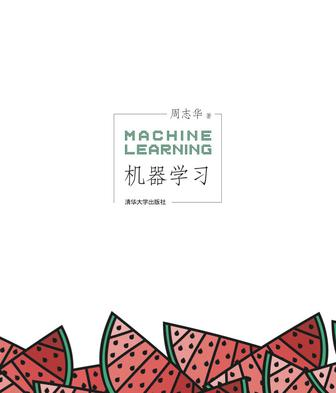

# 添加机器学习知识节点
机器学习

推荐书籍：  
* 周志华《机器学习》     
  
* 李航的《统计学习方法》    
  
* Deep Learning英文版[[web]](http://www.deeplearningbook.org/)
(中文版[[web]](https://github.com/exacity/deeplearningbook-chinese)下载请[点击](https://github.com/exacity/deeplearningbook-chinese/releases/download/v0.5-beta/dlbook_cn_v0.5-beta.pdf))  
  
* 机器学习实战  

> 机器学习算法python实现[参考](https://github.com/lawlite19/MachineLearning_Python)  
> 机器学习资源 |Machine learning Resources[参考](https://github.com/allmachinelearning/MachineLearning)

知识点(具体更新学习放在[这里](https://www.gitbook.com/book/peterchenyijie/machine_learning/details))：   
1.线性回归  
2.逻辑回归  
3.BP神经网络  
4.SVM支持向量机  
5.K-Means聚类算法  
6.PCA主成分分析  

