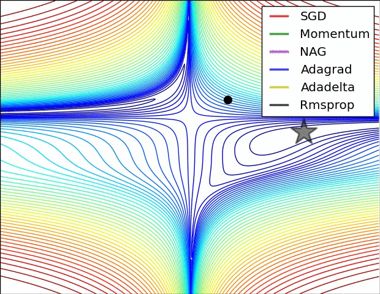

## 添加阅读论文及理解
初步论文阅读参照[深度学习论文阅读路线图](../Note/Deep_Learning_Papers_Reading_Roadmap.md)

目录  
* 2017-梯度下降优化算法综述
* 2017-COCO2017物体检测夺冠算法    

其他：
### x.优化
[2017-梯度下降优化算法综述](https://arxiv.org/abs/1609.04747)
* 全量梯度下降(Batch gradient descent) 
> 全量梯度下降每次学习都使用**整个训练集**，因此其优点在于每次更新都会**朝着正确的方向进行**，最后能够
保证收敛于极值点(凸函数收敛于全局极值点，非凸函数可能会收敛于局部极值点)，但是其缺点在于每次学
习**时间过长**，并且如果训练集很大以至于需要**消耗大量的内存**，并且全量梯度下降**不能进行在
线模型参数更新**

    for i in range(epochs):
        params_grad = evaluate_gradient(loss_function,data,params)
        params = params - learning_rate * params_grad
* 随机梯度下降(Stochastic gradient descent)  
> 随机梯度下降最大的缺点在于每次更新可能并不会按照正确的方向进行，因此可以带来**优化波动(扰动)**
不过从另一个方面来看，随机梯度下降所带来的波动有个好处就是，对于类似盆地区域（即很多局部极小值
点）那么这个波动的特点可能会使得优化的方向从当前的局部极小值点跳到另一个更好的局部极小值点，这
样便可能对于非凸函数，最终**收敛于一个较好的局部极值点，甚至全局极值点**。 由于波动，因此会使得迭
代次数（学习次数）增多，即**收敛速度变慢**。不过最终其会和全量梯度下降算法一样，具有相同的收敛性，
即凸函数收敛于全局极值点，非凸损失函数收敛于局部极值点。

    for i in range(epochs):
        np.random.shuffle(data)
        for example in data:
            params_grad = evaluate_gradient(loss_function,example,params)
            params = params - learning_rate * params_grad
* 小批量梯度下降(Mini-batch gradient descent)
>  Mini-batch梯度下降综合了batch梯度下降与stochastic梯度下降，在每次更新速度与更新次数中间取得一个平衡，
其每次更新从训练集中随机选择m,m<n个样本进行学习相对于随机梯度下降。Mini-batch梯度下降**降低了收敛波动性**，即降低了参数更新的方差，使得更新更
加稳定。相对于全量梯度下降，其**提高了每次学习的速度**。并且其**不用担心内存瓶颈**从而可以利用矩阵运
算进行高效计算。一般而言每次更新随机选择[50,256]个样本进行学习，但是也要根据具体问题而选择，
实践中可以进行**多次试验**，选择一个更新速度与更次次数都较适合的样本数。
```
for i in range(epochs):
    np.random.shuffle(data)
    for batch in get_batches(data, batch_size=50):
        params_grad = evaluate_gradient(loss_function,batch,params)
        params = params - learning_rate * params_grad  
```
存在的一些问题和挑战：
* 合理的学习率的选择
* 学习率调整（学习速率调度）  
* 模型每次更新的是使用相同的学习率
* 对于非凸目标函数，容易陷入那些次优的局部极值点中。同时，也可能会陷入鞍点[相关](http://arxiv.org/abs/1406.2572)  

梯度下降优化算法：
* Momentum 动量法
> 动量在参数更新项中加上一次更新量  

* NAG 涅斯捷罗夫梯度加速
> 也是引入动量项，但是在计算参数梯度中，在损失函数中减去了动量项

* Adagrad
> 该优化算法，能够对每一个参数自适应不同的学习率，适合处理稀疏特征数据。
对于其他模型，其更新模型参数都使用相同的学习速率，而Adagrad在更新步骤对于每一个模型参数
使用不同的学习率。

* Adadelta
> 是对Adagrad的一个改进，为降低其在学习速率衰减过快问题。主要体现在  
1 使用窗函数  
2 参数梯度历史窗口序列(不包括当前)不再使用平方和，而是使用均值代替  
3 最终的均值是历史窗口序列均值与当前梯度的时间衰减加权平均
* RMSprop
> 提出也是为了降低Adagrad中学习速率衰减过快问题

* Adam
> 一种不同参数自适应不同学习速率方法，与Adadelta与RMSprop区别在于，它计算历史梯度衰减方式不同，不使用历史平方衰减，
其衰减方式类似动量
  

各种优化对比:   


Adagrad、Adadelta与RMSprop在损失曲面上能够立即转移到正确的移动方向上达到快速的收敛。而Momentum 与NAG会导致偏离(off-track)
。同时NAG能够在偏离之后快速修正其路线，因为其根据梯度修正来提高响应性。  
在选择SGD优化器是，如果特征是稀疏的， 最好选择自适应学习速率SGD（Adagrad、Adadelata、RMSprop
与Adam），这不需要在迭代过程中对学习速率进行人工调整。目前来看，对于Adam可能是最好的SGD方式。

并行和分布式SGD
* Hogwild
* Downpour SGD
* Delay-tolerant Algorithms for SGD
* TensorFlow
* Elastic Averaging SGD   

更多SGD优化  
* Shuffling and Curriculum Learning
* Batch normalization
* Early Stopping
* Gradient noise

### x.物体检测  

[2017-COCO2017物体检测夺冠算法](http://cn.arxiv.org/abs/1711.07240)


该篇论文为COCO物体检测夺冠算法，原文作者解读视频[参见](https://v.douyu.com/show/zBjq4Mepw4Q75Ea8),
讲解PPT[[pdf]](https://www.jianguoyun.com/p/Ddkg60sQhprUBhjs0zw)
> * Variance Equivalence
> * Warmup Strategy
> * Cross-GPU Batch Normalization  

该篇论文对物体检测进行大的batch_size下的尝试,大的min_batch有很多优点：  
> * 也能够减少小batch_size带来的下降梯度不稳定
> * 更多的balanced sample ratio
> * 更加精准的BN统计（可能是由于BN统计需要较大一个数量才会更加精确。[TO DO]:还需要理解）
> * 训练更快    

在此篇论文中：
> * 多设备下的batch_norm  

> * Sublinear Memory

> * 更大的学习率的policy  


